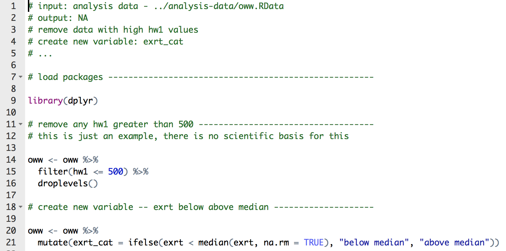
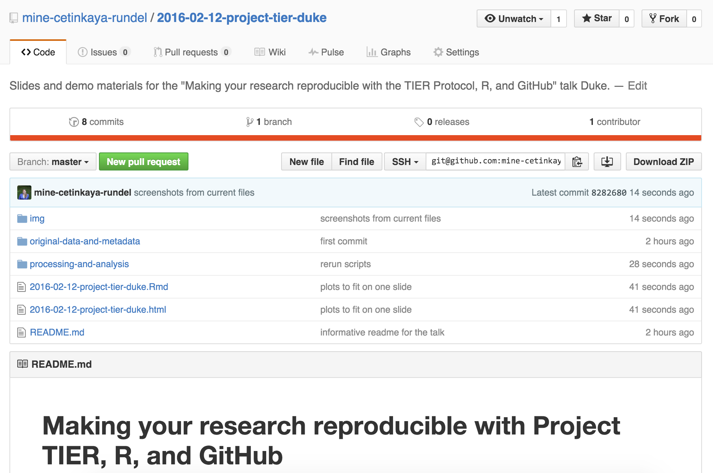
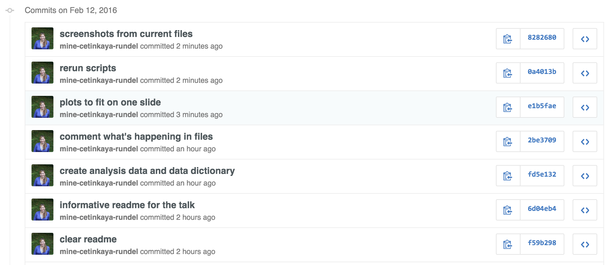
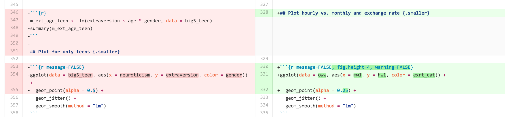

```{r echo=FALSE, message=FALSE}
library(dplyr)
library(ggplot2)
options(show.signif.stars=FALSE)
```

# Reproducibility: who cares?

## Science retracts gay marriage paper without agreement of lead author LaCour

- In May 2015 Science retracted a study of how canvassers can sway 
people's opinions about gay marriage published just 5 months earlier.

- Science Editor-in-Chief Marcia McNutt: Original survey data not made 
available for independent reproduction of results. + Survey incentives 
misrepresented. + Sponsorship statement false.

- Two Berkeley grad students who attempted to replicate the study quickly 
discovered that the data must have been faked.

- Methods we'll discuss today can't prevent this, but they can make it 
easier to discover issues.

<font size="3">Source: http://news.sciencemag.org/policy/2015/05/science-retracts-gay-marriage-paper-without-lead-author-s-consent</font>


## Bad spreadsheet merge kills depression paper, quick fix resurrects it

- **Original conclusion:** Lower levels of CSF IL-6 were associated with 
current depression and with future depression [...].

- **Revised conclusion:** Higher levels of CSF IL-6 and IL-8 were 
associated with current depression [...].

<br><br><br><br><br>

<font size="3">Source: http://retractionwatch.com/2014/07/01/bad-spreadsheet-merge-kills-depression-paper-quick-fix-resurrects-it/</font>


## Divorce study felled by a coding error gets a second chance

- **Original conclusion:** The risk of divorce in a heterosexual marriage increases when the wife falls ill, but not the husband. 

- **Corrected conclusion:** Based on the corrected analysis, we conclude that there are not gender differences in the relationship between gender, pooled illness onset, and divorce.

<br><br><br><br>

<font size="3">Source: http://retractionwatch.com/2015/09/10/divorce-study-felled-by-a-coding-error-gets-a-second-chance/#more-32151</font>

## Divorce study retraction: Editor's note

- "The research environment is fast-paced given the ethos to “publish or perish"."

- "[...] research is becoming increasingly complex, with greater calls for transdisciplinary collaborations, “big data,” and more sophisticated research questions and methods [...] data sets often have multiple files that require merging, change the wording of questions over time, provide incomplete codebooks, and have unclear and sometimes duplicative variables."

- "Given these issues, I would not be surprised if coding errors were fairly common [...]"

<br><br>

<font size="3">Source: http://retractionwatch.com/2015/09/10/divorce-study-felled-by-a-coding-error-gets-a-second-chance/#more-32151</font>


# Reproducibility: why should you care?

## Think back to every time...

- The results in Table 1 don't seem to correspond to those in Figure 2.
- In what order do I run these scripts?
- Where did we get this data file?
- Why did I omit those samples?
- How did I make that figure?
- "Your script is now giving an error."
- "The attached is similar to the code we used."

<br><br>

<font size="3">Source: Karl Broman</font>

## No collaborators?

<br><br><br><br>

Your closest collaborator is you six months ago, <br>
but you don’t reply to emails.
<br><br>
<font size="3">- Mark Holder</font>

<br><br><br>

# Reproducibility: how?

## Reproducibility checklist

- Are the tables and figures reproducible from the code and data?
- Does the code actually do what you think it does?
- In addition to what was done, is it clear *why* it was done? (e.g., how 
were parameter settings chosen?)
- Can the code be used for other data?
- Can you extend the code to do other things?

## Ambitious goal + many other concerns 

We need an environment where

- data, analysis, and results are tightly connected, or better yet, 
inseparable

- reproducibility is built in
    + the original data remains untouched
    + all data manipulations and analyses are inherently documented

- documentation is human readable and syntax is minimal


## Toolkit

<center>

</center>


## Outline

1. Scriptability $\rightarrow$ R

2. Literate programming $\rightarrow$ R Markdown

3. Version control $\rightarrow$ Git / GitHub


# 1. Scriptability

## Point-and-click vs. scripting

- Learning curve: Point-and-click software (supposedly) have shallower learning curves than scripting languages

- Documentation: At a minimum, your code documents your analysis
    + And you can do better with comments and README files

- Automation: Need to rerun your analysis with new/updated data? Just change the input file.

- Collaboration: Sharing your analysis is as easy as sharing your scripts

## Why R?

<div class="columns-2">
- Programming language for data analysis
- Free!
- Open source
- Widely used and supported across all disciplines
- Can be used on Windows, Mac OS X, or Linux
- Thousands of statistical data analysis packages


</div>


## Why not language X?

- There are a number of other great programming tools out there that can also be 
used to improve the reproducibility of your analysis

- The key is to use some type of language that will allow you to automate and 
document your analysis

- Once you master one language you'll probably find it easier to learn another


## Once in R

<div class="columns-2">
You could just type into the command prompt, but that doesn't help much with

- documentation

or

- automation


</div>


# 2. Literate programming

## Donald Knuth "Literate Programming (1983)"

"Instead of imagining that our main task is to instruct a *computer* what 
to do, let us concentrate rather on explaining to *human beings* what we 
want a computer to do."

"The practitioner of literate programming [...] strives for a program that 
is comprehensible because its concepts have been introduced in an order 
that is best for human understanding, using a mixture of formal and 
informal methods that reinforce each other."

- These ideas have been around for years!
- and tools for putting them to practice have also been around
- but they have never been as accessible as the current tools


## A better solution than just R

With RStudio you can combine your programming and your documentation

<div class="columns-2">
- Gives you a single environment to combine your documentation and your
analysis
- Runs on top of R


</div>


## What is Markdown?

- Markdown is a lightweight markup language for creating HTML (or XHTML) 
documents.

- Markup languages are designed to produce documents from human readable 
text (and annotations).

- Some of you may be familiar with LaTeX. This is another (less human 
friendly) markup language for creating pdf documents.

- Why I love Markdown:
    + Simple syntax means easy to learn and use.
    + Focus on **content**, rather than **coding** and debugging 
    **errors**.
    + Allows for easy web authoring.
    + Once you have the basics down, you can get fancy and add HTML,
    JavaScript, and CSS.

## Sample Markdown document


## What is R Markdown?

Well, it's R + Markdown:

- Ease of Markdown syntax

- Rendering of R code to produce output and plots

## Sample R Markdown document


## Another R Markdown document

<br><br><br><br>

<center>
This presentation!
</center>

<br><br><br><br>

## Example: Occupational Wages around the World

The [OWW database](http://www.nber.org/oww/) contains occupational wage data for 161 
occupations in 171 countries from 1983 to 2008. The occupational wage data are derived from 
the [ILO October Inquiry database](http://laborsta.ilo.org) by calibrating the data into a 
normalized wage rate for each occupation. The normalized wages refer to average hourly or 
monthly wage rates for adult workers.

<br><br>

Load data with an **R chunk**:

```{r}
load("processing-and-analysis/analysis-data/oww.RData")
```

<br><br>

<font size="3">Source: http://www.nber.org/oww/</font>

## Under the hood


## View data {.smaller}
```{r}
oww
```

## Clean data

You can include script files in your R Markdown document

```{r message=FALSE}
source("processing-and-analysis/command-files/02-data-cleanup.R")
```



## View distribution of `hw1` {.smaller}

```{r message=FALSE, fig.height=2.5}
ggplot(oww, aes(x = hw1)) +
  geom_histogram()
```

```{r}
summary(oww$hw1)
```

## Regress hourly vs. monthly and exchange rate {.smaller}

```{r message=FALSE}
m_hw1_mw1 <- lm(hw1 ~ mw1 * exrt_cat, data = oww)
summary(m_hw1_mw1)
```

## Plot hourly vs. monthly and exchange rate {.smaller}

```{r message=FALSE, fig.height=4, warning=FALSE}
ggplot(data = oww, aes(x = mw1, y = hw1, color = exrt_cat)) +
  geom_point(alpha = 0.25) +
  geom_smooth(method = "lm")
```

## Math typesetting

LaTeX:

$\hat{y} = \beta_0 + \beta_1 \times x$

# 3. Version control

## What is version control?

Version control is a system that records changes to a file or set of files over time so that you can recall specific versions later.

## Bad

<center>

</center>

<font size="3">Source: Piled Higher and Deeper by Jorge Cham, http://www.phdcomics.com.</font>


## Good

~~~
    2013-10-14_manuscriptFish.doc
    2013-10-30_manuscriptFish.doc
    2013-11-05_manusctiptFish_intitialRyanEdits.doc
    2013-11-10_manuscriptFish.doc
    2013-11-11_manuscriptFish.doc
    2013-11-15_manuscriptFish.doc
    2013-11-30_manuscriptFish.doc
    2013-12-01_manuscriptFish.doc
    2013-12-02_manuscriptFish_PNASsubmitted.doc
    2014-01-03_manuscriptFish_PLOSsubmitted.doc
    2014-02-15_manuscriptFish_PLOSrevision.doc
    2014-03-14_manuscriptFish_PLOSpublished.doc
~~~


## Better - Saving everything together at once

Everytime you make a save, you zip the entire directory that your project files are in and save it with a date.


## Best - Version Control

<center>

</center>

<br>

<font size="3">Source: https://github.com/mine-cetinkaya-rundel/2016-02-12-project-tier-duke.</font>

## How does a version control system work? {.smaller}

- Start with a base version of the document, save just the changes you made at each step of the way.

- Think of it as a tape: if you rewind the tape and start at the base document, then you can play back each change and end up with your latest version.

<center>

</center>

- "Playing back" different sets of changes onto the base document and getting different versions of the document.

<center>

</center>

<font size="3">Source: [Software Carpentry](https://software-carpentry.org/).</font>

## Git/GitHub

- Easy to set up
- Integrated with RStudio
- GitHub's strong community: your colleagues are probably already there
- Provides tools to help enhance collaboration
- A common location to share your work

**Note:** GitHub repositories are public. If you need a private repository that 
you will use for education or research purposes, you can request one.

## Commits

<center>

</center>

## Diff

<center>

</center>

# Project TIER on GitHub

## Project TIER

You can find the folder structures outlined in the TIER Protocol in the
Project TIER organization on GitHub:

https://github.com/ProjectTIER

- For R: Repository is called `ProjectTIER_R`
- For STATA: Repository **will be** called `ProjectTIER_STATA` (in progress)

## Fork

- Create a GitHub account if you don't yet have one: https://github.com/
- Form the `ProjectTIER_R` repository, which will create a copy in your account

## Set up git in RStudio

We're going to avoid local installation for now...

Go to https://vm-manage.oit.duke.edu/containers

- Log in with your Duke NetID
- Click on RStudio which will launch an R session for you

In RStudio:

- Go to Tools -> Shell
- Type the two lines of code, replacing my information with your own
    
~~~
$ git config --global user.name "Mine Cetinkaya-Rundel"
$ git config --global user.email "mine@stat.duke.edu"
~~~

## Clone

In RStudio:

- Go to File -> New Project -> Version Control -> Git
- Go back to your forked GitHub repo and copy the HTTPS URL
- Insert this into Repository URL
- Click on Create Project

## Edit, stage, commit, push

- Edit one of the Markdown files

- Go to the Git page in RStudio
    + Stage changes by checking the box
    + Commit (with an informative message)
    + Push

- View your changes on GitHub

## git/GitHub, why?

**Most powerful argument:** Automatic tracking of changes

**Other arguments:**

- No download/upload
- Ease of collaboration with ability to resolve merge conflicts
- Searchability
- ...

# Parting remarks

## Two-pronged approach

Everyone struggles with reproducibility and it is a hindrance to moving 
science forward.

<div class="columns-2">
\#1 
Adopt a reproducible research workflow

<br><br>

\#2
Train new researchers who don’t have any other workflow


</div>

## Resources

- Slides and repository for this talk: https://github.com/mine-cetinkaya-rundel/2016-02-12-project-tier-duke

- Project TIER on GitHub: https://github.com/ProjectTIER
    + For R: https://github.com/ProjectTIER/ProjectTIER_R
    + For STATA: In progress

- R Markdown: http://rmarkdown.rstudio.com/

- RStudio and git: https://support.rstudio.com/hc/en-us/articles/200532077-Version-Control-with-Git-and-SVN

- Try Git: https://try.github.io

- Reproducible Science Curriculum (2 day workshop): https://github.com/Reproducible-Science-Curriculum/